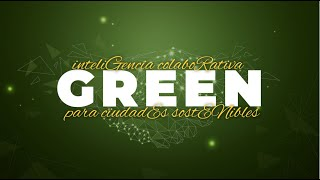
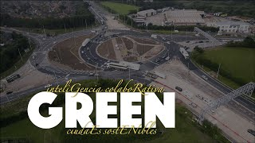

# Multimedia de GREEN

Este directorio contiene diversos materiales multimedia utilizados para la difusión y comunicación del proyecto GREEN. Los recursos incluyen folletos, banners, posters, y presentaciones que explican y promocionan los objetivos, tecnologías, y avances del proyecto.

## Enlaces a Playlists de YouTube

Accede a las playlists de YouTube relacionadas con el proyecto GREEN para conocer más sobre nuestras iniciativas, conferencias, y tutoriales:

  
  
  

## Contenido de la Carpeta

### Folletos

- **`Folleto-GREEN-1.png`**: Primera parte deñ folleto del proyecto GREEN, destacando el propósito, objetivos y beneficios de la iniciativa. Incluye información sobre cómo GREEN transforma las ciudades para hacerlas más sostenibles mediante el uso de tecnologías innovadoras.

- **`Folleto-GREEN-2.png`**: Segunda parte del folleto del proyecto que proporciona detalles adicionales sobre las tecnologías clave (Aprendizaje Federado, Blockchain, y Smart Contracts) y casos de uso específicos, como la optimización de estaciones de recarga de vehículos eléctricos.

### Banners y Posters

- **`GREEN - BannerGREEN.jpg`**: Banner promocional utilizado en conferencias y eventos para visualizar la marca GREEN y su enfoque en la sostenibilidad urbana a través de inteligencia colaborativa.

- **`GREEN-poster-1.png`**: Poster explicativo que detalla la plataforma tecnológica de GREEN, incluyendo los módulos de aprendizaje federado, blockchain, y simulación, así como su aplicación en entornos urbanos.

### Presentaciones

- **`GREEN-slide-1.png`**: Diapositiva utilizada en presentaciones oficiales del proyecto. Incluye gráficos y diagramas que ilustran la arquitectura del sistema y los flujos de datos entre los diferentes componentes tecnológicos de GREEN.

### Documentos de Soporte

- **`HIB_Capabilities.pdf`**: Documento que resume las capacidades y proyectos de HI Iberia en inteligencia artificial, incluyendo el proyecto GREEN. Describe cómo GREEN utiliza tecnologías avanzadas para optimizar recursos y garantizar la privacidad de los datos en entornos urbanos sostenibles.

## Uso del Material

Los archivos en esta carpeta son utilizados para:

- **Promoción y Difusión**: En eventos, conferencias, y reuniones con stakeholders para explicar los objetivos y avances del proyecto.
- **Educación y Capacitación**: Como material de apoyo para talleres y sesiones de formación sobre tecnologías de IA, sostenibilidad urbana, y ciudades inteligentes.
- **Comunicación Pública**: Para comunicar de manera clara y efectiva el impacto del proyecto GREEN en la sociedad.

